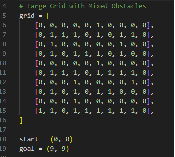
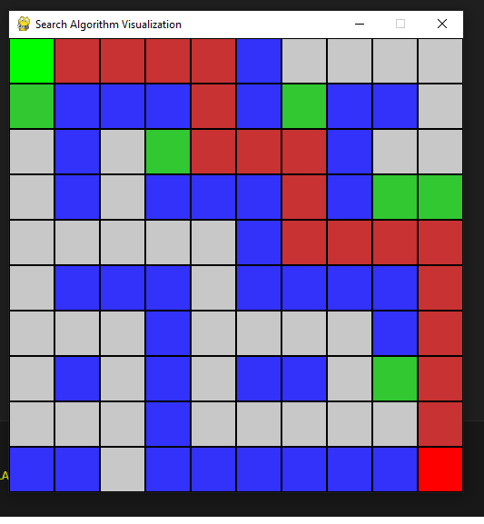
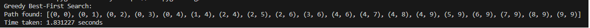
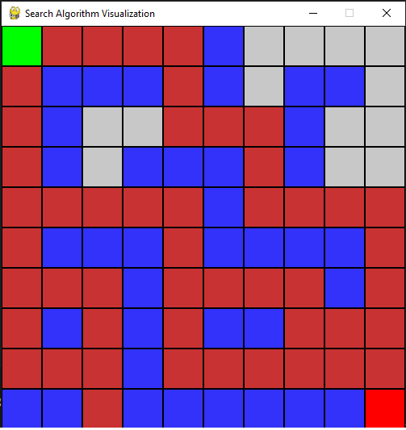
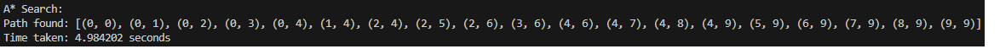
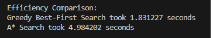
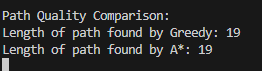

# Programming Activity: Pathfinding Algorithms in Python
<br/>

## **Presented by:**

Abayari, Rob Fritz <br/>
De jesus, Michael Ivan <br/>
Duhaylungsod, Kyziah Mae <br/>
Elomina, Marc Ryzon <br/>
Garcia, John Charles <br/>
Guevarra, Shane Ashley <br/>
Pantonia, John Carlo <br/>
Salamat, Rolph <br/>
Saturno, M-jey <br/>

## 2.1 Overview of the algorithms implemented.

## 2.2 Instructions on how to run the code. <br/>

**1. clone this repository**


```console 
$ git clone https://github.com/JCharls1/CSEG_Pathfinding_Comparison.git
```

**2. Open the folder in vs code**

**3. run the python code**
```console 
$ python main.py
```
or
```console 
$ python3 main.py
```

## Dependencies


**pygame**<br/>
- https://pypi.org/project/pygame/


```console 
$ pip install pygame
```

or

```console 
$ pip3 install pygame
```

## 2.3 Description of your approach and any challenges faced.

# Screenshots: Include screenshots of the output from your program showing:

## The paths found by both algorithms.

Grid<br/>

<br/>

Greedy
<br/>

<br/>

A*
<br/>

<br/>


## The time taken for each algorithm.

<br/>


## The lengths of the paths.


<br/>
